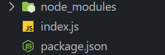
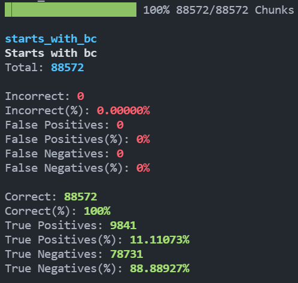

<div align="center"> <h1>Fauton</h1> </div>
<div align="center"><b>A library to test any finite automaton with arbitrary alphabets</b></div>

</br>

<p align="center">
  <a href="https://app.codecov.io/gh/Devorein/fauton/branch/master"></a>
  
  
  
</p>

## Features

1. Test any dfa/nfa/ε-nfa
2. Supports arbitrary alphabets
3. Easy to use api to generate input strings
4. ε-nfa to nfa conversion
5. Generate artifacts files for each automaton
6. Highly customizable
7. Full typescript support
8. Simple concise error messages for invalid finite automaton
9. Generate full graph for ε-nfa given a string

## Example (A simple dfa)

Lets start out with a simple dfa, that checks whether an input string starts with `bc`. The alphabets of the dfa are `a, b, c`


```js
// import the class from the library
const { DeterministicFiniteAutomaton, FiniteAutomataTest } = require('fauton');
const path = require('path');

const startsWithBC = new DeterministicFiniteAutomaton(
	// Callback that will be passed each of the input string to test whether its should be accepted by the dfa or not
	(inputString) => inputString.startsWith('bc'),
	{
		// Required: The alphabets dfa accepts
		alphabets: ['a', 'b', 'c'],
		// Optional: A description of what the dfa does
		description: 'Starts with bc',
		// Required: An array of final states of the dfa
		final_states: ['Q3'],
		// Required: Label of the dfa. Convention is to use snake_case words
		label: 'starts_with_bc',
		// Required: Start state of the dfa
		start_state: 'Q0',
		// Required: An array of states the dfa accepts
		states: ['Q0', 'Q1', 'Q2', 'Q3'],
		// Required: A object of transition
		// Each key represents the state
		// The value is an array of strings, which should be equal to the length of the alphabets
		// Here if we are in state 'Q1' and we encounter symbol 'a', we move to the state 'Q2'
		transitions: {
			Q0: ['Q2', 'Q1', 'Q2'],
			Q1: ['Q2', 'Q2', 'Q3'],
			// this 'loop' is the same as ['Q2', 'Q2', 'Q2']
			// For automaton with bigger alphabets it might be difficult to write that out so its added as a convenience
			Q2: 'loop',
			Q3: 'loop',
		},
	}
);
```

Internally this is how the transitions map will be generated

```js
const transitions = {
	Q0: {
		a: 'Q2',
		b: 'Q1',
		c: 'Q2',
	},
	Q1: {
		a: 'Q2',
		b: 'Q2',
		c: 'Q3',
	},
	// Due to 'loop'
	Q2: {
		a: 'Q2',
		b: 'Q2',
		c: 'Q2',
	},
	Q3: {
		a: 'Q3',
		b: 'Q3',
		c: 'Q3',
	},
};
```

This is our file directory structure at the moment.

Lets test the dfa we created above and see whether its actually correct or not.



```js
// The constructor takes only one argument, the directory where the all the artifact files will be generated
// if its not present, it will be created
const finiteAutomataTest = new FiniteAutomataTest(path.join(__dirname, 'logs'));

// Call the test method to test out the automaton
// We will learn more about the array thats being passed later
finiteAutomataTest.test([
	{
		// The automaton to test
		automaton: startsWithBC,
		// A configuration object that is used to feed input strings to the automaton
		options: {
			type: 'generate',
			range: {
				maxLength: 10,
			},
		},
	},
]);
```

This is the file structure after running the script. It generates several artifact files for you to investigate.


1. `<dfa.label>.accepted.txt`: Will contain all the strings that will be accepted by the automaton
2. `<dfa.label>.aggregate.txt`: Will contain an aggregated result of the test. Its similar to what is shown in the terminal
3. `<dfa.label>.case.txt`: Contains the result for each input string test case.
4. `<dfa.label>.correct.txt`: Contains all the strings that generated the same boolean result from the logic test callback and the automaton.
5. `<dfa.label>.incorrect.txt`: Contains all the strings that generated different boolean result from the logic test callback and the automaton
6. `<dfa.label>.input.txt`: Contains all the input strings. Useful when you are feeding random or ranged strings and want to reuse it for later
7. `<dfa.label>.rejected.txt`: Contains all the strings that have been rejected by the automaton

And this is what will be shown in the terminal


### Breakdown

Better and more detailed api documentation coming soon very soon !!!

Take a look at the [examples](./examples) folder to understand how to write a dfa test and use this package.
