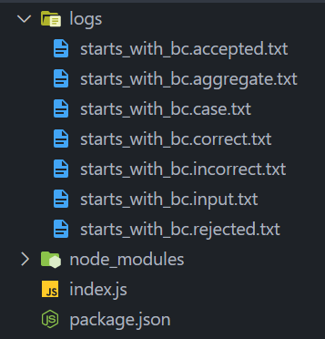
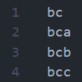
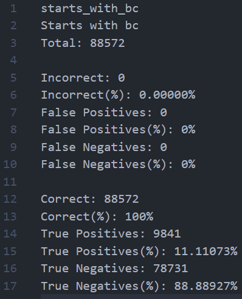
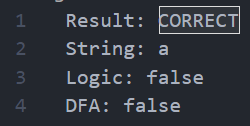
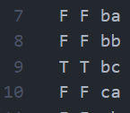

<div align="center"> <h1>Fauton</h1> </div>
<div align="center"><b>A library to test any finite automaton with arbitrary alphabets</b></div>

</br>

<p align="center">
  <a href="https://app.codecov.io/gh/Devorein/fauton/branch/master"></a>
  
  
  
</p>

- [Features](#features)
- [Examples](#examples)
  - [Dfa for string that starts with bc](#dfa-for-string-that-starts-with-bc)
  - [Binary string divisible by 2 or 3 but not both](#binary-string-divisible-by-2-or-3-but-not-both)
- [Generated artifact files](#generated-artifact-files)
  - [Sample artifact files](#sample-artifact-files)
  - [`<fa.label>.accepted.txt`](#falabelacceptedtxt)
  - [`<fa.label>.aggregate.txt`](#falabelaggregatetxt)
  - [`<fa.label>.case.txt`](#falabelcasetxt)
  - [`<fa.label>.correct.txt`](#falabelcorrecttxt)
  - [`<fa.label>.incorrect.txt`](#falabelincorrecttxt)
  - [`<fa.label>.input.txt`](#falabelinputtxt)
  - [`<fa.label>.rejected.txt`](#falabelrejectedtxt)
- [Terminal Output](#terminal-output)
  - [Sample terminal output](#sample-terminal-output)
  - [Incorrect Portion](#incorrect-portion)
  - [Correct Portion](#correct-portion)
- [Contributors](#contributors)

# Features

1. Test any dfa/nfa/ε-nfa
2. Supports arbitrary alphabets
3. Easy to use api to generate input strings
4. ε-nfa to nfa conversion
5. Generate artifacts files for each automaton
6. Highly customizable
7. Full typescript support
8. Simple concise error messages for invalid finite automaton
9. Generate full graph for ε-nfa given a string

# Examples

## Dfa for string that starts with bc

Lets start out with a simple dfa, that checks whether an input string starts with `bc`. The alphabets of the dfa are `a, b, c`


```js
// import the class from the library
const { DeterministicFiniteAutomaton, FiniteAutomataTest } = require('fauton');
const startsWithBC = new DeterministicFiniteAutomaton(
	// Callback that will be passed each of the input string to test whether its should be accepted by the dfa or not
	(inputString) => inputString.startsWith('bc'),
	{
		// Required: The alphabets dfa accepts
		alphabets: ['a', 'b', 'c'],
		// Optional: A description of what the dfa does
		description: 'Starts with bc',
		// Required: An array of final states of the dfa
		final_states: ['Q3'],
		// Required: Label of the dfa. Convention is to use snake_case words
		label: 'starts_with_bc',
		// Required: Start state of the dfa
		start_state: 'Q0',
		// Required: An array of states the dfa accepts
		states: ['Q0', 'Q1', 'Q2', 'Q3'],
		// Required: A object of transition
		// Each key represents the state
		// The value is an array of strings, which should be equal to the length of the alphabets
		// Here if we are in state 'Q1' and we encounter symbol 'a', we move to the state 'Q2'
		transitions: {
			Q0: ['Q2', 'Q1', 'Q2'],
			Q1: ['Q2', 'Q2', 'Q3'],
			// this 'loop' is the same as ['Q2', 'Q2', 'Q2']
			// For automaton with bigger alphabets it might be difficult to write that out so its added as a convenience
			Q2: 'loop',
			Q3: 'loop',
		},
	}
);
```

Internally this is how the transitions map will be generated

```js
const transitions = {
	Q0: {
		a: 'Q2',
		b: 'Q1',
		c: 'Q2',
	},
	Q1: {
		a: 'Q2',
		b: 'Q2',
		c: 'Q3',
	},
	Q2: {
		a: 'Q2',
		b: 'Q2',
		c: 'Q2',
	},
	Q3: {
		a: 'Q3',
		b: 'Q3',
		c: 'Q3',
	},
};
```

Lets test the dfa we created above and see whether its actually correct or not.

```js
// The constructor takes only one argument, the directory where the all the artifact files will be generated, if its not present, it will be created
const finiteAutomataTest = new FiniteAutomataTest(path.join(__dirname, 'logs'));

// Call the test method to test out the automaton
// We will learn more about the array thats being passed later
finiteAutomataTest.test([
	{
		// The automaton to test
		automaton: startsWithBC,
		// A configuration object that is used to feed input strings to the automaton
		options: {
			type: 'generate',
			range: {
				maxLength: 10,
			},
		},
	},
]);
```

## Binary string divisible by 2 or 3 but not both

In this case it will be better if we construct two dfa's and merge them together to form the final dfa.

Let `D2` be the dfa responsible for checking divisibility by 2 and `D3` be responsible for divisibility by 3

Our condition is `(D2 OR D3) AND NOT(D2 AND D3)`, meaning either the string passes through `D2` or `D3`, but not by both. So `2` will be accepted, `3` will be accepted but `6` will be rejected as its divisible by both `2` and `3`


Lets convert it to code !!!

```js
const { FiniteAutomataTest, DeterministicFiniteAutomaton } = require('fauton');
const path = require('path');

const DivisibleBy3 = new DeterministicFiniteAutomaton(
	(inputString) => parseInt(inputString, 2) % 3 === 0,
	{
		alphabets: ['0', '1'],
		final_states: ['A'],
		label: 'divisible_by_3',
		start_state: 'A',
		states: ['A', 'B', 'C'],
		transitions: {
			A: ['A', 'B'],
			B: ['C', 'A'],
			C: ['B', 'C'],
		},
		description: 'Dfa to accept strings divisible by 3',
	}
);

const DivisibleBy2 = new DeterministicFiniteAutomaton(
	(inputString) => parseInt(inputString, 2) % 2 === 0,
	{
		alphabets: ['0', '1'],
		final_states: ['X'],
		label: 'divisible_by_2',
		start_state: 'X',
		states: ['X', 'Y'],
		transitions: {
			X: ['X', 'Y'],
			Y: ['X', 'Y'],
		},
		description: 'Dfa to accept strings divisible by 2',
	}
);

const DivisibleBy2Or3 = DivisibleBy2.OR(DivisibleBy3);
const NotDivisibleBy2And3 = DivisibleBy2.AND(DivisibleBy3).NOT();

const DivisibleBy3Or2ButNotByBoth = DivisibleBy2Or3.AND(NotDivisibleBy2And3);

const finiteAutomataTest = new FiniteAutomataTest(path.resolve(__dirname, 'logs'));
finiteAutomataTest.test([
	{
		automaton: DivisibleBy3Or2ButNotByBoth,
		options: {
			type: 'generate',
			range: {
				maxLength: 10,
			},
		},
	},
]);

// Merged transitions
console.log(DivisibleBy3Or2ButNotByBoth.automaton.transitions);
// Merged start state
console.log(DivisibleBy3Or2ButNotByBoth.automaton.start_state);
// Merged final states
console.log(DivisibleBy3Or2ButNotByBoth.automaton.final_states);
```

```sh
> {
  'X.A': { '0': [ 'X.A' ], '1': [ 'Y.B' ] },
  'Y.A': { '0': [ 'X.A' ], '1': [ 'Y.B' ] },
  'X.B': { '0': [ 'X.C' ], '1': [ 'Y.A' ] },
  'Y.B': { '0': [ 'X.C' ], '1': [ 'Y.A' ] },
  'X.C': { '0': [ 'X.B' ], '1': [ 'Y.C' ] },
  'Y.C': { '0': [ 'X.B' ], '1': [ 'Y.C' ] }
}
> X.A
> [ 'Y.A', 'X.B', 'X.C' ]
```

It automatically generates the merged transitions, new start and final states

# Generated artifact files

After running the test, artifact files will be generated in the folder specified in the `FiniteAutomataTest` class constructor. These files contain additional information about the test and starts with the label of the dfa.

## Sample artifact files

Sample artifact files shown inside `logs` directory



## `<fa.label>.accepted.txt`

Contains all the strings that will be accepted by the automaton



## `<fa.label>.aggregate.txt`

Contains an aggregated result of the test. Its similar to what is shown in the terminal. See [Terminal Output](#terminal-output)



## `<fa.label>.case.txt`

Contains detailed results for each input string test case.



- Result: `CORRECT` if `fa.result == logic.result`, `WRONG` otherwise
- String: Input string
- Logic: `logic.result`
- FA: `fa.result`

## `<fa.label>.correct.txt`

Contains all the strings that generated the same boolean result from the logic test callback and the automaton.



- First column: `fa.result`
- Second column: `logic.result`
- Third column: Input string

## `<fa.label>.incorrect.txt`

Contains all the strings that generated different boolean result from the logic test callback and the automaton

Same as `<fa.label>.correct.txt`

## `<fa.label>.input.txt`

Contains all the input strings. Useful when you are generating random or ranged strings and want to reuse it for later

Same as `<fa.label>.accepted.txt`

## `<fa.label>.rejected.txt`

Contains all the strings that have been rejected by the automaton

Same as `<fa.label>.accepted.txt`

# Terminal Output

While the test is proceeding the progress will be shown in the terminal, and once its done an aggregated result of the test will be shown as below.

## Sample terminal output


- `fa.result`: Indicates the result from the finite automata
- `logic.result`: Indicates the result from the logic test

The progress bar shows the number of input strings that's been processed. Beneath that the label, description and the total number of input strings are shown

## Incorrect Portion

- `Incorrect`: Total number of strings where the automaton and logic test gave different result. Conditions:-
  - `fa.result = false && logic.result = true`
  - `fa.result = true && logic.result = false`
- `Incorrect(%)`: Percentage of strings that are incorrect out of all strings
- `False Positives`: Total number of strings that didn't pass the logic test but passed the automata test. Condition:-
  - `fa.result = true && logic.result = false`
- `False Positives(%)`: Total number of false positives out of all strings
- `False Negatives`: Total number of strings that passed the logic test but didn't pass the automata test. Condition:-
  - `fa.result = false && logic.result = true`
- `False Negatives(%)`: Total number of false negatives out of all strings

## Correct Portion

- `Correct`: Total number of strings where the automaton and logic test gave same result. Conditions:-
  - `fa.result = true && logic.result = true`
  - `fa.result = false && logic.result = false`
- `Correct(%)`: Percentage of strings that are correct out of all strings
- `True Positives`: Total number of strings that passed both the logic and automata test. Condition:-
  - `fa.result = true && logic.result = true`
- `True Positives(%)`: Total number of true positives out of all strings
- `True Negatives`: Total number of strings that didn't pass both the logic and automata test. Condition:-
  - `fa.result = false && logic.result = false`
- `True Negatives(%)`: Total number of true negatives out of all strings

Better and more detailed api documentation coming soon very soon !!!

# Contributors

1.  Safwan Shaheer [github](https://github.com/Devorein) Author, Maintainer

Feel free to submit a pull request or open a new issue, contributions are more than welcome !!!

Take a look at the [examples](./examples) folder or check out the documentation to learn more.
